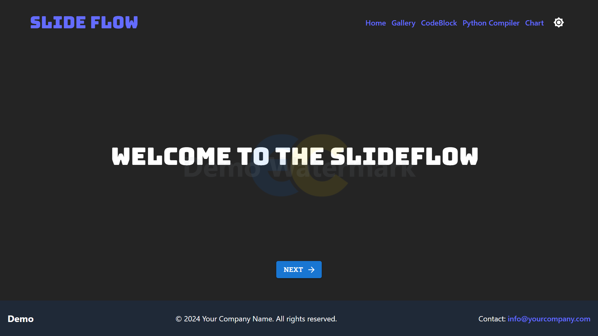
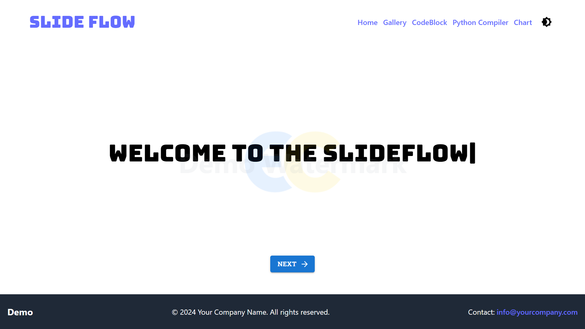
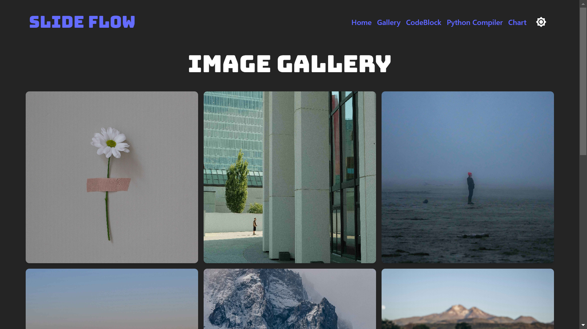
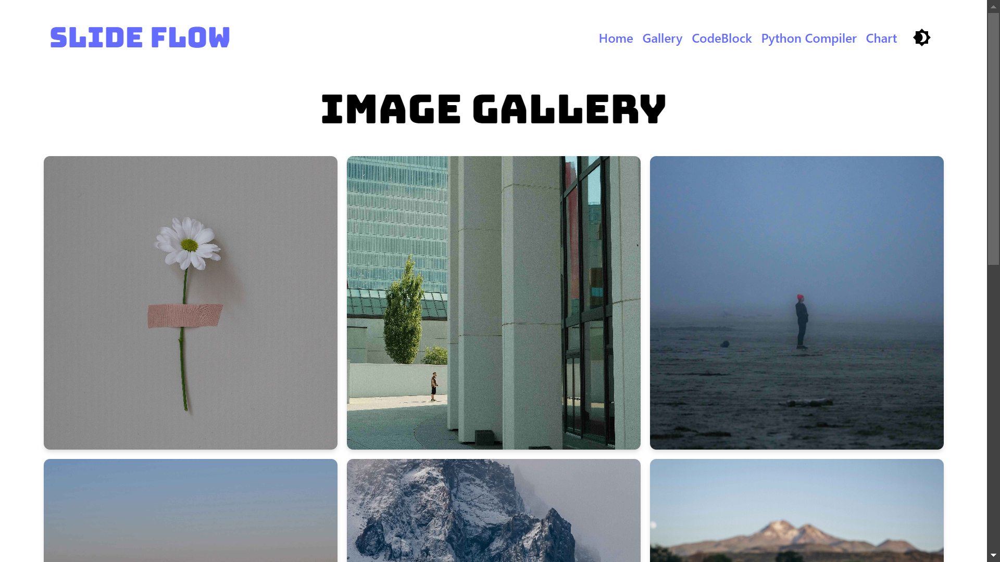
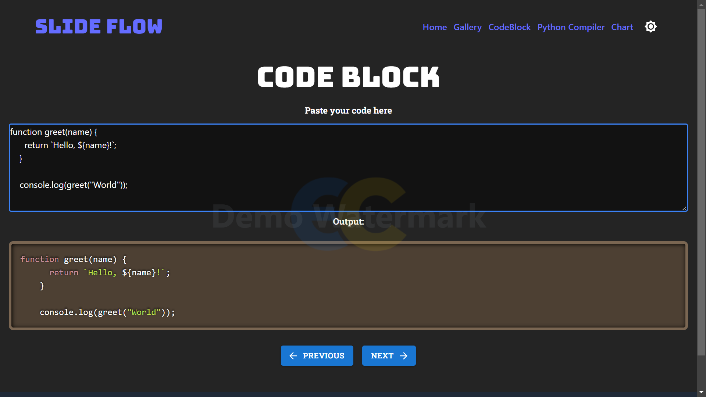
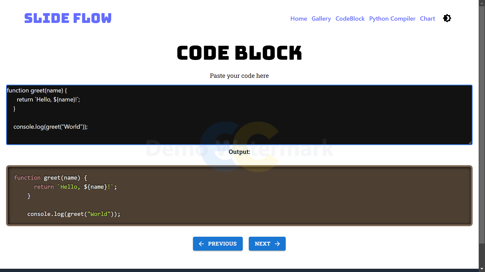
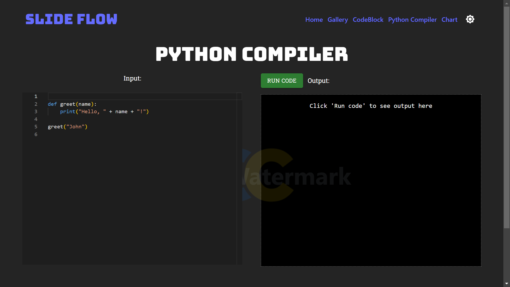
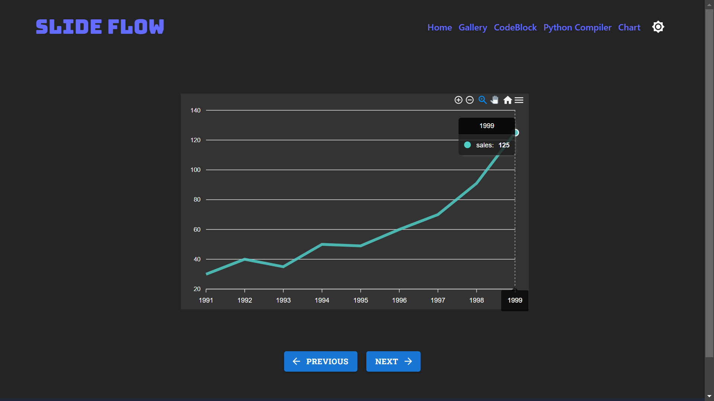
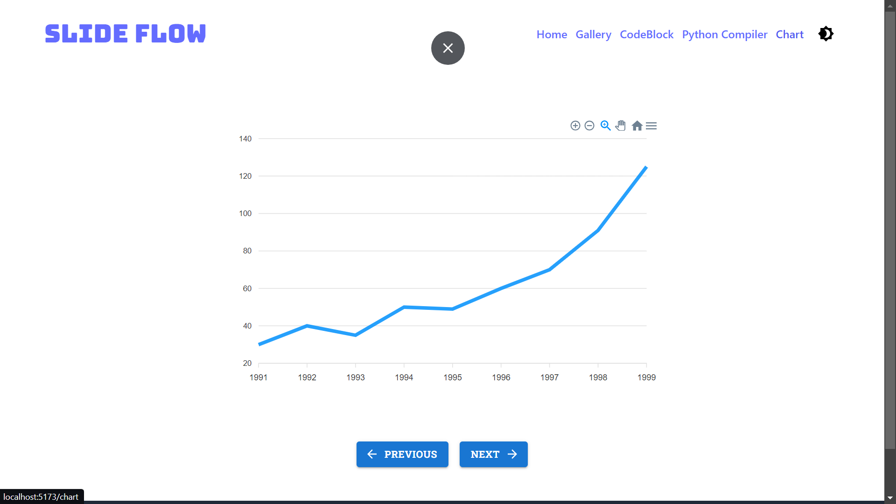
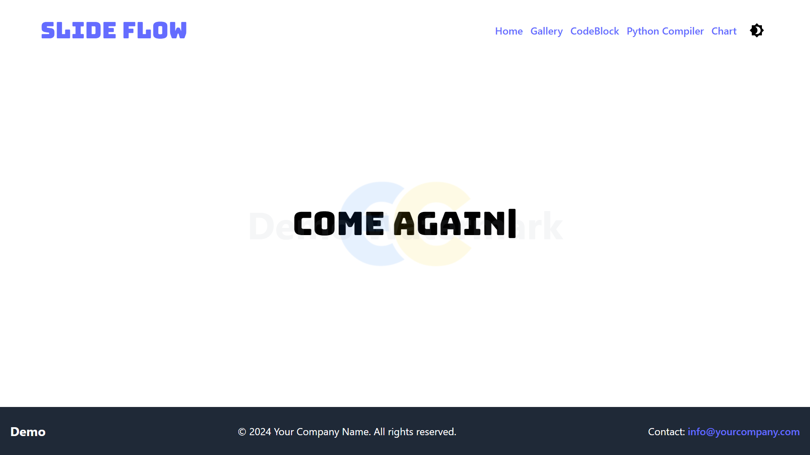

# Slide Flow

Slide Flow is a React-based presentation application built with Vite. It features multiple interactive slides including a welcome slide, image gallery, code editor, Python compiler, and chart display, all wrapped in a consistent layout with header and footer components. The application supports dark and light modes, managed through Redux.

## Screenshots

Here are some screenshots showcasing the different slides and features of Slide Flow:



*Welcome Slide: The initial view users see when opening the application.*



*Gallery Slide: Displaying a grid of images with smooth loading animations.*



*Code Editor Slide: Featuring syntax highlighting and a sleek interface.*



*Python Compiler Slide: Allowing users to write and execute Python code directly in the browser.*



*Chart Slide: Showcasing interactive data visualization capabilities.*



*Chart Slide: the final slide.*


## Getting Started

These instructions will get you a copy of the project up and running on your local machine for development and testing purposes.

### Prerequisites

- Node.js (version 14 or later)
- Yarn package manager

### Installation

1. Clone the repository:
   ```
   git clone https://github.com/yourusername/slide-flow.git
   ```

2. Navigate to the project directory:
   ```
   cd slide-flow
   ```

3. Install dependencies:
   ```
   yarn install
   ```

### Running the Application

To start the development server:

```
yarn dev
```

This will start the application on `http://localhost:5173` (or another port if 5173 is already in use).

## Project Structure

The main components of the project are:

- `AppRouter.jsx`: Main routing component
- `Header.jsx`: Header component with dark/light mode toggle
- `Footer.jsx`: Footer component displayed on all pages
- `Layout.jsx`: Layout component that wraps all slides and displays a watermark
- `WelcomeSlide.jsx`: Initial welcome slide
- `GallerySlide.jsx`: Image gallery slide
- `CodeSlide.jsx`: Code editor slide
- `CompilerPy.jsx`: Python compiler slide
- `ChartSlide.jsx`: Chart display slide

## Code Documentation

### AppRouter.jsx

This component sets up the routing for the application using React Router. It also applies the dark mode class based on the Redux state.

Key functions:
- Uses `useEffect` to apply dark mode class to the body based on Redux state.
- Wraps all routes with the Header, Layout, and Footer components for consistent page structure.

### Header.jsx

Provides a consistent header across all pages of the application, including a dark/light mode toggle.

Key features:
- Includes navigation links, logo, or other persistent UI elements.
- Contains a toggle for switching between dark and light modes.
- Uses Redux to manage and persist the dark/light mode state.

### Footer.jsx

Displays a consistent footer across all pages of the application.

Key features:
- May include copyright information, additional links, or other relevant details.

### Layout.jsx

Wraps the main content of each page and adds a watermark.

Key features:
- Provides consistent padding or margins for content.
- Adds a watermark to all pages.

### GallerySlide.jsx

Displays a grid of images with a loading animation.

Key components:
- `GalleryItem`: Handles individual image loading and display.

### CodeSlide.jsx

Provides a code editor with syntax highlighting.

Key features:
- Uses Monaco Editor for code editing.
- Displays the entered code with syntax highlighting.

### CompilerPy.jsx

Offers a Python code compiler with input and output areas.

Key functions:
- `runCode()`: Sends the code to a backend API for execution and displays the result.

### ChartSlide.jsx

Renders a line chart using ApexCharts.

Key features:
- Responsive chart that adapts to dark/light mode.
- Uses Framer Motion for animations.

## State Management

This project uses Redux for state management, particularly for handling the dark/light mode toggle. The dark mode state is stored in the Redux store and can be accessed and modified by various components throughout the application.

## Built With

- [React](https://reactjs.org/)
- [Vite](https://vitejs.dev/)
- [React Router](https://reactrouter.com/)
- [Redux](https://redux.js.org/)
- [Monaco Editor](https://microsoft.github.io/monaco-editor/)
- [ApexCharts](https://apexcharts.com/)
- [Framer Motion](https://www.framer.com/motion/)
- [Material-UI](https://material-ui.com/)
- [Yarn](https://yarnpkg.com/) (Package Manager)

## Contributing

Please read [CONTRIBUTING.md](CONTRIBUTING.md) for details on our code of conduct, and the process for submitting pull requests to us.

## License

This project is licensed under the MIT License - see the [LICENSE.md](LICENSE.md) file for details.


